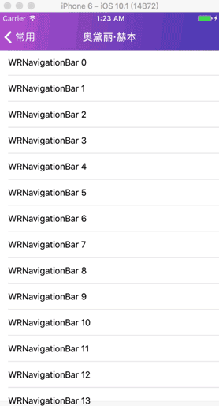
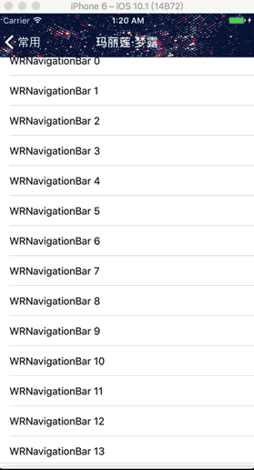
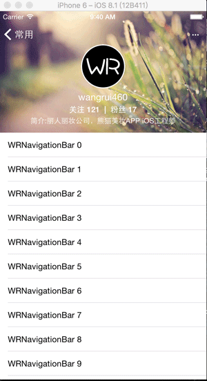
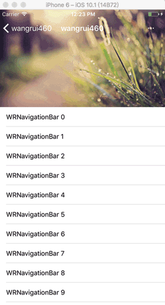
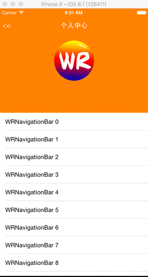
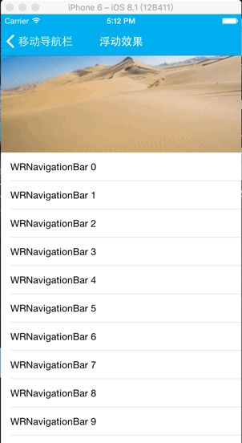

# EFNavigationBar

[](https://travis-ci.org/EFPrefix/EFNavigationBar)
[](https://cocoapods.org/pods/EFNavigationBar)
[](https://cocoapods.org/pods/EFNavigationBar)
[](https://cocoapods.org/pods/EFNavigationBar)

## Overview














## Example

To run the example project, clone the repo, and run `pod install` from the Example directory first.

## Requirements

- iOS 8+
- Xcode 8+

## Installation

EFNavigationBar is available through [CocoaPods](https://cocoapods.org). To install
it, simply add the following line to your Podfile:

```ruby
pod 'EFNavigationBar'
```

## Use

具体使用方法请参考Demo
<pre><code>
// 一行代码搞定导航栏颜色
navBarBarTintColor = .white
// 一行代码搞定导航栏透明度
navBarBackgroundAlpha = alpha
// 一行代码搞定导航栏两边按钮颜色
navBarTintColor = UIColor(red: 0, green: 0.478431, blue: 1, alpha: 1.0)
// 一行代码搞定导航栏上标题颜色
navBarTitleColor = .black
// 一行代码搞定状态栏是 default 还是 lightContent
statusBarStyle = .default
// 一行代码搞定导航栏底部分割线是否隐藏
navBarShadowImageHidden = true;
</code></pre>

<pre><code>
// 设置导航栏默认的背景颜色
UIColor.defaultNavBarBarTintColor = UIColor.init(red: 0/255.0, green: 175/255.0, blue: 240/255.0, alpha: 1)
// 设置导航栏所有按钮的默认颜色
UIColor.defaultNavBarTintColor = .white
// 设置导航栏标题默认颜色
UIColor.defaultNavBarTitleColor = .white
// 统一设置状态栏样式
UIColor.defaultStatusBarStyle = .lightContent
// 如果需要设置导航栏底部分割线隐藏，可以在这里统一设置
UIColor.defaultShadowImageHidden = true
</code></pre>

## Other

- The original code of [EFNavigationBar](https://github.com/EFPrefix/EFNavigationBar) come from [WRNavigationBar_swift](https://github.com/wangrui460/WRNavigationBar_swift/commit/a445f74ac57d675f87a60a49a745c5a3b01b6324), since the `WRNavigationBar_swift` project seems to be no longer maintained, so `EFNavigationBar` project has been established;
- For Objective-C version, see [WRNavigationBar](https://github.com/wangrui460/WRNavigationBar).

## Author

EyreFree, eyrefree@eyrefree.org

## License

EFNavigationBar is available under the MIT license. See the LICENSE file for more info.
